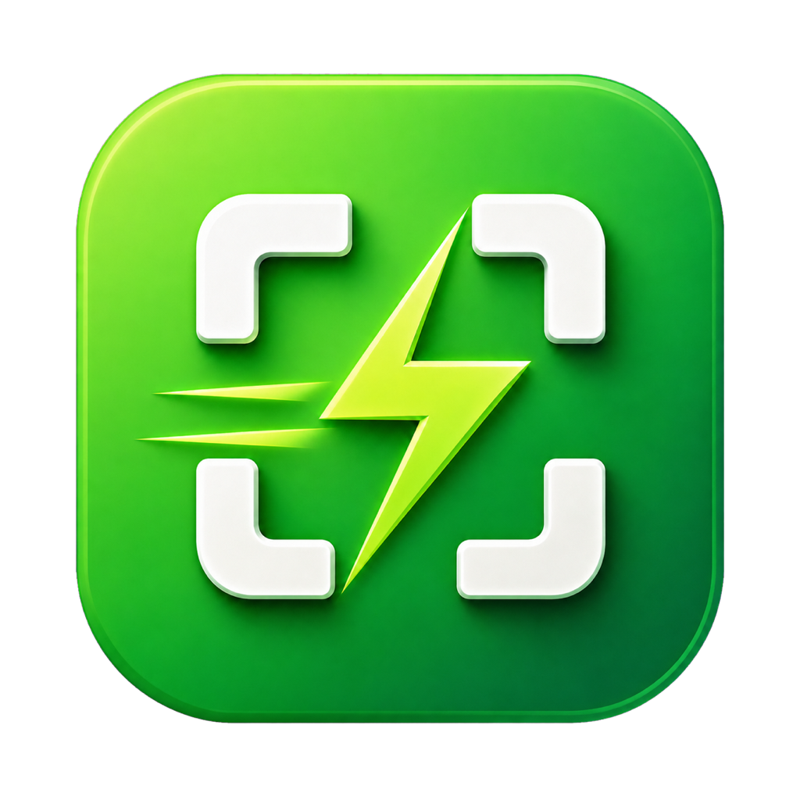

# 轻截（CutScreen）

一款原生、轻量的 macOS 菜单栏截图工具。默认按 `Control + Command + A` 唤出，支持窗口识别、自由框选、标注、滚动长截图、桌面贴图、剪贴板和本地保存。



## 功能

- 菜单栏常驻，无 Dock 图标、无主窗口
- 可修改全局快捷键，默认 `⌃⌘A`
- 登录时启动开关，默认关闭
- 多显示器截图，窗口悬停识别和自由框选
- 矩形、圆形、铅笔、箭头、序号、马赛克
- 固定色板、三档线宽、撤销、重做和删除
- 手动向下滚动并自动拼接长截图
- 置顶桌面贴图，可移动、缩放、复制和保存
- 确认复制 PNG；保存支持 PNG 和 JPEG

## 系统和开发环境

- macOS 13 或更高版本
- Xcode 16 或更高版本
- Swift 6

项目是一个 Swift Package，可直接使用 Xcode 打开 `Package.swift`。为了正确显示应用名称、隐藏 Dock 图标并获得独立的录屏权限身份，日常运行建议先构建标准应用包。

## 构建和运行

```bash
make test
make app
open build/CutScreen.app
```

首次截图时，macOS 会请求“屏幕与系统音频录制”权限。授权后退出并重新打开轻截，再按 `⌃⌘A`。

调试构建可以使用：

```bash
swift build
swift test
```

## 发布构建

本地开发默认使用 ad-hoc 签名。DMG 可通过以下命令生成：

```bash
make dmg
```

正式发布所需的签名身份和公证凭据应配置在本机环境或钥匙串中，不要提交到版本库。

## 使用说明

1. 按 `⌃⌘A` 或点击菜单栏“开始截图”。
2. 单击高亮窗口，或拖拽创建自由选区。
3. 使用选区下方工具栏标注；未选择标注工具时可以移动选区或已有标注。
4. 滚动长截图必须在添加标注前开始。进入后手动向下滚动，点击“完成”或再次按截图快捷键结束。
5. “确认”复制 PNG，“保存”写入本地，“钉在桌面”创建置顶贴图。

滚动长截图目前仅支持垂直向下。动态视频、受保护内容和变化幅度过大的页面可能无法可靠拼接。

## 隐私说明

截图和标注均在本机完成。应用不包含账号系统、网络上传或云端存储功能。
